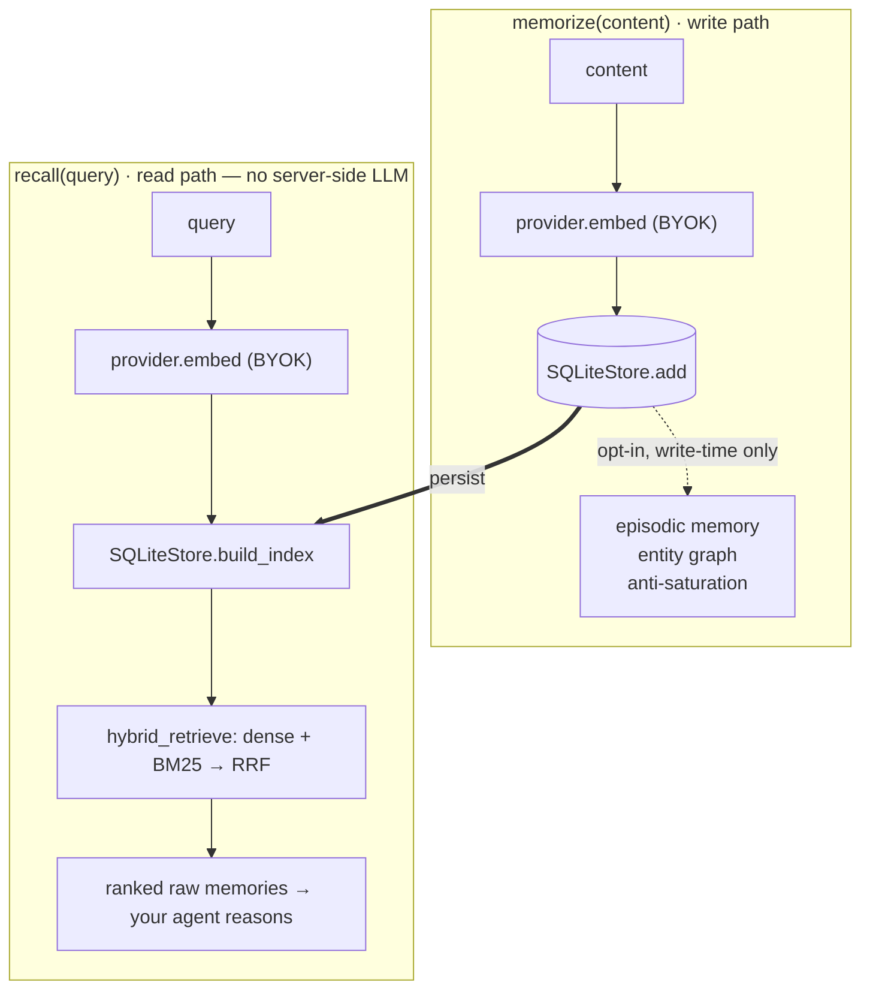

# Cortex Protocol

🧠 **One memory. Every agent.** — user-owned, cross-agent AI memory over the Model Context Protocol.

[](https://pypi.org/project/cortex-protocol/)
[](https://pypi.org/project/cortex-protocol/)
[](https://pypi.org/project/cortex-protocol/)
[](https://github.com/fernsdavid25/cortex-protocol/blob/main/LICENSE)
[](https://github.com/fernsdavid25/cortex-protocol/actions/workflows/ci.yml)
[](https://codecov.io/gh/fernsdavid25/cortex-protocol)

**Works with Claude Code · Cursor · Claude Desktop · VS Code**

You own **one** portable memory, and any AI agent connects to it over MCP with your consent.
Self-host it as a local stdio server — a single SQLite file, your own Gemini key (BYOK), **nothing
phones home** — and `recall` does **no** server-side LLM generation, so the only runtime cost is your
own embedding tokens.

> **📊 0.932 LongMemEval_S · 0.813 LoCoMo — #1 on accuracy-per-dollar** — premium-tier retrieval
> quality paired with a **cheap Gemini reader** at **~$0.008/question**, not raw accuracy at any cost.

## Architecture

Two hot paths — `memorize` embeds once and persists; `recall` embeds once and runs a pure hybrid
retrieval with **no server-side generation**. Three enrichment layers bolt on at **write time only**,
so recall stays byte-identical whether they are on or off (grounded in
[`docs/ARCHITECTURE.md`](https://github.com/fernsdavid25/cortex-protocol/blob/main/docs/ARCHITECTURE.md)).



## Why Cortex

- **User-owned, not company-owned.** *You* decide which agents see your memory — versus incumbents
  where the business owns it. One memory, every agent.
- **#1 on accuracy-per-dollar.** Cortex targets the best accuracy *per dollar*, not raw accuracy at
  any cost: premium-tier retrieval quality with a **cheap Gemini reader** (~$0.008/question on
  LongMemEval_S), with $/question published.
- **Run anywhere, no operator cost.** Self-host is a single SQLite file — no Docker, no DB server.
  One config snippet wires it into any MCP client.

## Results

**📊 0.932 LongMemEval_S · 0.813 LoCoMo — #1 on accuracy-per-dollar.** Two public long-term-memory
benchmarks; positioning stated honestly — **not raw SOTA, but #1 accuracy-per-dollar** (a cheap
Gemini reader at a fraction of the leaders' premium-reader cost).

| Benchmark | Cortex | Raw rank | Reader (cost) | Retrieval recall@k |
|---|---|---|---|---|
| **LongMemEval_S** (500 q) | **0.932** | #2 raw · **#1 acc/$** | `gemini-3.5-flash`, top_k=50, preference-mode, answer-first · **~$0.008/q** | 0.998 |
| **LoCoMo** (1986 q) | **0.813** | #3 raw · **#1 acc/$** | `gemini-2.5-flash`, top_k=100, answer-first · **~$0.0034/q** | 0.998 |

### How Cortex compares (LongMemEval_S)

| System | LongMemEval_S | Reader | ~$/q | Judge |
|---|---|---|---|---|
| **Cortex** (this repo) | **0.932** | `gemini-3.5-flash` (cheap) | **~$0.008** | gemini-flash |
| Mastra | 0.949 | `gpt-5-mini` (premium) | — | GPT-4o |
| Zep / Graphiti | 0.712 | `gpt-4o` (premium) | — | GPT-4o |
| Mem0 | not published¹ | — (graph) | — | — |

<sub>Numbers from the verified [leaderboard research](https://github.com/fernsdavid25/cortex-protocol/blob/main/bench/results/leaderboard_research.md).
**Not apples-to-apples:** competitor scores are self-reported under *their own* judges; Cortex is
graded by a `gemini-3.5-flash` judge (likely more lenient than the canonical `gpt-4o-2024-08-06`), and
`~$/q` is only published where Cortex measures it. ¹Mem0 has no verifiable LongMemEval_S number that
survived verification — it reports LoCoMo (0.61–0.66) instead. Leaders use pricier readers.</sub>

> **The reader is cheap by choice.** These numbers use a deliberately cheap reader
> (`gemini-3.5-flash` on LongMemEval, `gemini-2.5-flash` on LoCoMo). The retrieval pipeline is
> **reader-agnostic** — point `CORTEX_READER_MODEL` at a premium model (`gemini-3.1-pro`, Claude
> Opus) and accuracy climbs into the **top tier of the raw leaderboard**: in our own reader sweep,
> `gemini-3.1-pro` scored highest of every reader we tested. We publish the cheap-tier numbers on
> purpose — **premium-tier retrieval quality at ~10× lower reader cost** (#1 on accuracy-per-dollar)
> is the thesis, not raw accuracy at any cost.

> **Judge disclosure (load-bearing).** All Cortex numbers above are graded by an **LLM judge =
> `gemini-3.5-flash`**. The canonical LongMemEval judge is `gpt-4o-2024-08-06`; a Gemini judge is
> likely *more lenient*, so a GPT-4o re-grade (pending an OpenAI key) may lower these. As one
> cross-model sanity check, an independent Claude panel re-graded all 282 LoCoMo multi-hop cases and
> closely tracked the harness (panel 0.528 vs harness 0.589). The **accuracy-per-dollar** claim does
> not depend on the judge.

**LongMemEval_S 0.932** — per question type: single-session-user 0.957, single-session-assistant
0.982, single-session-preference 0.900, knowledge-update 0.949, temporal-reasoning 0.925,
multi-session 0.902, abstention 0.867 (mean ~25.7k input tokens/q). Under our judge, 0.932 sits
**above ByteRover (0.928, claimed) and Hindsight (0.914)** and below only the premium-reader leader
**Mastra (0.949, gpt-5-mini)** — while clearing Emergence (0.860), Supermemory (0.852), and Zep
(0.712), all of which use pricier readers. *(Competitor rows use their own judges — the leaderboard
is not apples-to-apples; canonical judge is GPT-4o.)*

#### Per question type — Cortex vs the field

One overall number hides where a memory system wins or loses. Split by LongMemEval_S question
type, Cortex — the **only cheap-reader system in the field** — stays in the top tier of the
premium-reader systems, and leads outright on single-session-assistant and multi-session recall:


| Question type | **Cortex** `flash` | Mastra `premium` | EmergenceMem `premium` | Supermemory `premium` | Zep `premium` |
|---|:--:|:--:|:--:|:--:|:--:|
| Knowledge update | **94.9** | 96.2 | 83.3 | 89.7 | 83.3 |
| Single-session assistant | **98.2** | 94.6 | 100.0 | 98.2 | 80.4 |
| Single-session user | **95.7** | 95.7 | 98.6 | 98.6 | 92.9 |
| Temporal reasoning | **92.5** | 95.5 | 85.7 | 82.0 | 62.4 |
| Multi-session | **90.2** | 87.2 | 81.2 | 76.7 | 57.9 |
| Single-session preference | **90.0** | 100.0 | 60.0 | 70.0 | 56.7 |
| **Overall** | **93.2** | 94.9 | 86.0 | 85.2 | 71.2 |

<sub>Cortex's row is our own run (`gemini-3.5-flash` reader + judge). Competitor rows are each
system's own published LongMemEval_S results under its **own premium reader and judge** — the field's
reported standing, **not** a single apples-to-apples harness (the parody Supermemory "8/12-variant
ensemble" columns are excluded as satire; the real *Initial* column is used). Cortex's abstention
category (0.867) is omitted — competitors don't report it. Higher is better.</sub>

**LoCoMo 0.813** — per category: single-hop 0.864, multi-hop 0.695, temporal 0.857, open-domain
0.458, adversarial/abstention 0.836. This **beats the graph-memory systems** (Mem0 0.61–0.66, Zep
0.585–0.62) and is on par with the strong retrieval baseline EMem (0.78–0.84), behind only Cognis
(~0.925, Claude-Opus reader + reranker). Doubling retrieval depth (k=50→100) is what recovers
multi-hop (+10.6pt) — the LoCoMo frontier is retrieval depth, not reader capability.

### Beyond a benchmark — does memory make an agent *better?*

`bench/agent_uplift/` runs the **same** multi-session tasks three ways and grades them
deterministically. Each answer depends on a fact stated in an *earlier* session, so an agent with no
memory of it cannot succeed (9 scenarios, top_k=5, live Gemini):

| Arm | Pass rate | Mean input tokens |
|---|---|---|
| **memoryless** (final task only) | **0.00** | 89.8 |
| full_context (all prior sessions stuffed in) | 1.00 | 168.6 |
| **cortex** (top-k `recall` only) | **1.00** | 142.6 |

Memory is the difference between **0% and 100%**. Cortex matches full-context accuracy while feeding
the agent only the *relevant* recalled memories — and unlike full-context, its cost stays **bounded
by top-k** instead of growing with total history. On the `secret-store` scenario (one fact buried in
**12** sessions), cortex feeds 5 recalled memories vs full-context's 12 (**125 vs 212 input tokens**,
a 0.59 ratio); the gap widens with history length. That is the point: memory that holds accuracy at a
cost that does not blow up over a long relationship.

### Reproduce

```bash
# LongMemEval_S — 0.932 headline (full 500):
python -m cortex_bench.run --system cortex-v0 --variant s --limit 500 \
  --reader-model gemini-3.5-flash --top-k 50 --preference-mode --answer-first \
  --max-output-tokens 8192 --judge gemini --judge-votes 3

# LoCoMo — 0.813 (put locomo10.json in bench/data/ first):
python -m cortex_bench.run --system cortex-v0 --locomo --reader-model gemini-2.5-flash \
  --top-k 100 --answer-first --max-output-tokens 8192 --judge gemini

# agent uplift:
uv run python bench/agent_uplift/harness.py --provider gemini
```

Full methodology + per-type tables:
[`bench/results/PHASE3_authoritative.md`](https://github.com/fernsdavid25/cortex-protocol/blob/main/bench/results/PHASE3_authoritative.md)
(LongMemEval) and
[`bench/results/LOCOMO_results.md`](https://github.com/fernsdavid25/cortex-protocol/blob/main/bench/results/LOCOMO_results.md)
(LoCoMo); verified competitor leaderboard:
[`bench/results/leaderboard_research.md`](https://github.com/fernsdavid25/cortex-protocol/blob/main/bench/results/leaderboard_research.md).

## Features

| Capability | What it does | Status |
|---|---|---|
| **Hybrid retrieval** | Dense (Gemini embeddings) + Okapi BM25, fused with Reciprocal Rank Fusion; deep top-k drives recall@k ≈ 1.0. | **On** (all paths) |
| **Chain-of-Note reader** | The reader takes structured notes over the retrieved memories before answering, with **calibrated abstention** — it declines when no memory supports an answer instead of hallucinating. | **On** (benchmark path) |
| **Episodic memory + `recall_timeline`** | One cheap `gemini-2.5-flash-lite` call per `memorize` structures event_time / actor / location, powering the `recall_timeline` tool. **Write-time cost only — recall is byte-identical**, so the accuracy-per-dollar guarantee holds. | Opt-in (`CORTEX_EPISODIC=1`) |
| **Entity graph + `recall_about`** | At `memorize` time, entities and relationships are folded into the **same** cheap extraction call that does episodic. Builds an ego knowledge graph rooted at a synthetic `self` entity — typed nodes (person / place / org / project / thing) joined by labeled, directed relationships, each memory attached to the entity it's about — powering the `recall_about` tool. **Write-time cost only — recall stays byte-identical.** | Opt-in (`CORTEX_GRAPH=1`) |
| **Anti-saturation** | Write-time **dedup** (embedding-only, no LLM) bounds store growth; **contradiction soft-update** (one cheap arbiter call) supersedes stale facts so recall returns only the latest value. Saturation harness (2000-write synthetic stream): **41.8% duplicate rows dropped, 100% latest-value retrieval**. | Engine-level, opt-in |

See [`docs/decades-scale.md`](https://github.com/fernsdavid25/cortex-protocol/blob/main/docs/decades-scale.md)
for the decades-scale retrieval analysis (self-host SQLite recall is O(n): measured ~95 ms @ 1k
memories → ~7.7 s p50 @ 50k).

## Quickstart — self-host (local memory in your agent)

The local server (`cortex-mcp`) is a **stdio MCP server**: your own Gemini key (BYOK), memories in a
local SQLite file (`~/.cortex/memory.db`), **nothing phones home**.

1. **Get a Gemini key** (free): <https://aistudio.google.com/apikey>
2. **Add Cortex to your MCP client.** Every client uses the same `mcpServers` shape — only the file
   differs:

```json
{
  "mcpServers": {
    "cortex": {
      "command": "uvx",
      "args": ["--from", "cortex-protocol", "cortex-mcp"],
      "env": { "GEMINI_API_KEY": "your-key-here" }
    }
  }
}
```

| Client | Config file |
|---|---|
| **Claude Code** | `~/.claude.json` (global), or `.mcp.json` in a project |
| **Cursor** | `~/.cursor/mcp.json` (global), or `.cursor/mcp.json` in a project |
| **Claude Desktop** | `claude_desktop_config.json` (Settings → Developer → Edit Config) |
| **VS Code** | `.vscode/mcp.json` |

Restart the client. That exposes six tools (the last two are gated on opt-in memory layers — see
**Config (env)** below):

| Tool | What it does |
|---|---|
| `memorize(content, kind?, tags?)` | Save a durable memory (optionally classified into one of six kinds). |
| `recall(query, limit?)` | Retrieve the most relevant memories (hybrid dense + BM25, RRF; no LLM generation). |
| `list_memories(limit?)` | List the most recent memories. |
| `forget(memory_id)` | Delete a memory (a short id prefix works if unambiguous). |
| `recall_about(entity, limit?)` | Exhaustive dossier for one entity — a person, place, project, org, thing, or yourself — every relationship plus every memory attached to it. A pure keyed read, no LLM/embedding call. **Requires `CORTEX_GRAPH=1`.** |
| `recall_timeline(query?, limit?)` | Dated event timeline — memories ordered by their extracted `event_time` (for "what happened when" questions). A pure keyed read, no LLM/embedding call. **Requires `CORTEX_EPISODIC=1`.** |

**From a checkout** (before the package is on PyPI): `python -m cortex.mcp.server`, or in the client
config use `"command": "uv", "args": ["run", "--with", "fastmcp", "python", "-m", "cortex.mcp.server"]`.

**Config (env):** `GEMINI_API_KEY` / `GOOGLE_API_KEY` (required); optional `CORTEX_DB_PATH`,
`CORTEX_USER_ID`, `CORTEX_EMBED_MODEL`, `CORTEX_EMBED_DIM`, `CORTEX_TOP_K` (default recall depth 5).

**Opt-in memory layers (off by default).** `CORTEX_GRAPH=1` builds the entity graph and enables
`recall_about`; `CORTEX_EPISODIC=1` structures event time / actor / location and enables
`recall_timeline`; `CORTEX_EXTRACT_MODEL` (default `gemini-2.5-flash-lite`) is the model that does
that extraction. Enabling either adds **one cheap flash-lite call per `memorize`** (write-time only,
on your own key — when both are on they share a single extraction call). **`recall` stays
byte-identical**, so the accuracy-per-dollar guarantee is unchanged. See
[`examples/`](https://github.com/fernsdavid25/cortex-protocol/tree/main/examples) and
[`.env.example`](https://github.com/fernsdavid25/cortex-protocol/blob/main/.env.example).

**Claude Desktop one-click:** build the `.mcpb` bundle and drag it onto Desktop — it prompts for your
Gemini key and runs the same six tools. See
[`packaging/mcpb/`](https://github.com/fernsdavid25/cortex-protocol/tree/main/packaging/mcpb).

## Security & privacy

- **BYOK, no phone-home.** Your Gemini key is read from the environment and used only to call
  Google's API. The local server has no backend and sends nothing anywhere else.
- **Your memory text is embedded by Google.** Each `memorize`/`recall` sends the content/query to
  Google's embedding API *under your own key* — pick a key/project whose data-handling terms you're
  comfortable with.
- **Local storage is a plain file.** Memories live unencrypted in `~/.cortex/memory.db`
  (`CORTEX_DB_PATH`). Don't store secrets; protect the file like any local data, and set
  `CORTEX_DB_PATH` only from trusted config (not from untrusted/agent input).

## Develop

```bash
uv run pytest            # offline, deterministic test suite (FakeProvider — no live LLM calls)
uvx ruff check server    # lint
```

See [`CHANGELOG.md`](https://github.com/fernsdavid25/cortex-protocol/blob/main/CHANGELOG.md) for
release notes and [`bench/README.md`](https://github.com/fernsdavid25/cortex-protocol/blob/main/bench/README.md)
for the benchmark harness.

## License

[Apache-2.0](https://github.com/fernsdavid25/cortex-protocol/blob/main/LICENSE)
