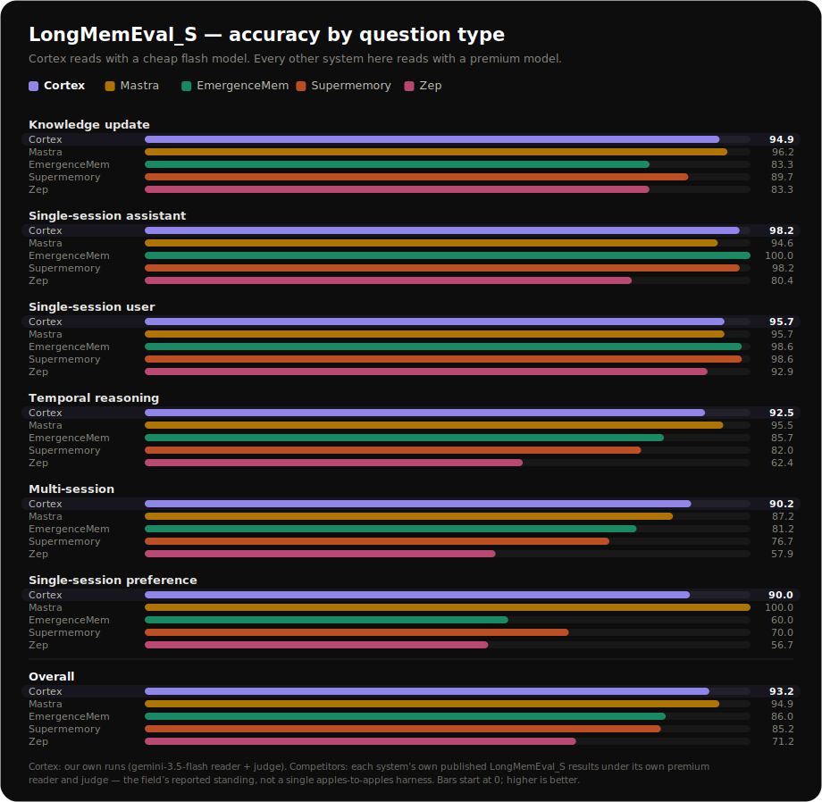

# Cortex Protocol

🧠 **One memory. Every agent.** — user-owned, cross-agent AI memory over the
[Model Context Protocol](https://modelcontextprotocol.io).

You own **one** portable memory, and any AI agent connects to it over MCP with your consent.
Self-host it as a local stdio server — a single SQLite file, your own Gemini key (BYOK),
**nothing phones home** — and `recall` does **no** server-side LLM generation, so the only
runtime cost is your own embedding tokens.

!!! quote "📊 0.932 LongMemEval_S · 0.813 LoCoMo — #1 on accuracy-per-dollar"
    Premium-tier retrieval quality paired with a **cheap Gemini reader** at **~$0.008/question** —
    not raw accuracy at any cost.

## Install

Run the local memory server straight from PyPI — no clone, no build:

```bash
uvx --from cortex-protocol cortex-mcp
```

Then wire it into any MCP client (Claude Code, Cursor, Claude Desktop, VS Code) with a single
config block — see [Connecting Cortex to your agent](https://github.com/fernsdavid25/cortex-protocol/blob/main/examples/README.md).
You supply your own key (`GEMINI_API_KEY` or `GOOGLE_API_KEY`); get one at
[Google AI Studio](https://aistudio.google.com/apikey).

## The tools

The stdio server exposes six agent-facing tools:

| Tool | What it does |
|---|---|
| `memorize(content, kind?, tags?)` | Embed + persist one durable memory (optionally one of six `kind`s and short `tags`). |
| `recall(query, limit?)` | Hybrid dense + BM25 (RRF) retrieval; returns ranked raw memories, **no LLM generation**. |
| `recall_about(entity, limit?)` | Exhaustive per-entity dossier from the entity graph — a pure keyed read. **Requires `CORTEX_GRAPH=1`.** |
| `recall_timeline(since?, until?, limit?)` | Dated events in chronological order from the episodic layer. **Requires `CORTEX_EPISODIC=1`.** |
| `list_memories(limit?)` | The most recently saved memories, newest first. |
| `forget(memory_id)` | Delete by full id or an unambiguous short-id prefix (ambiguous prefixes are refused). |

## Benchmarks — per question type

Split by LongMemEval_S question type, Cortex — the **only cheap-reader system in the field** —
holds the top tier of the premium-reader systems, and leads on single-session-assistant and
multi-session recall:



Competitor rows are each system's own published results under their own premium readers and judges
(not a single apples-to-apples harness). The full results table, cost-per-question, and reproduce
commands are in the [README](https://github.com/fernsdavid25/cortex-protocol/blob/main/README.md#results).

## Where next

- **[Architecture](ARCHITECTURE.md)** — a contributor-facing tour of the engine: the provider
  abstraction (BYOK), the persistent store, the hybrid retrieval core, and the opt-in
  write-time enrichment layers.
- **[Decades-scale](decades-scale.md)** — how recall scales from a personal SQLite store to a
  decades-long, multi-user hosted store (pgvector HNSW, AlloyDB ScaNN), with measured latency.
- **[API reference](api.md)** — the `CortexMemory` engine and the `LLMProvider` contract for
  writing your own provider.
- **[README](https://github.com/fernsdavid25/cortex-protocol/blob/main/README.md)** — the full
  project overview, results, and quickstart.
- **Runnable examples** — [`examples/quickstart.py`](https://github.com/fernsdavid25/cortex-protocol/blob/main/examples/quickstart.py)
  (memorize + recall, offline) and
  [`examples/custom_provider.py`](https://github.com/fernsdavid25/cortex-protocol/blob/main/examples/custom_provider.py)
  (write your own provider).
